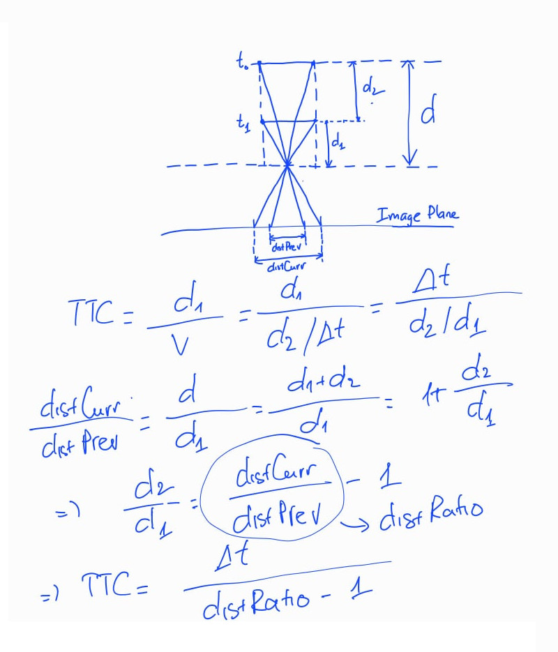
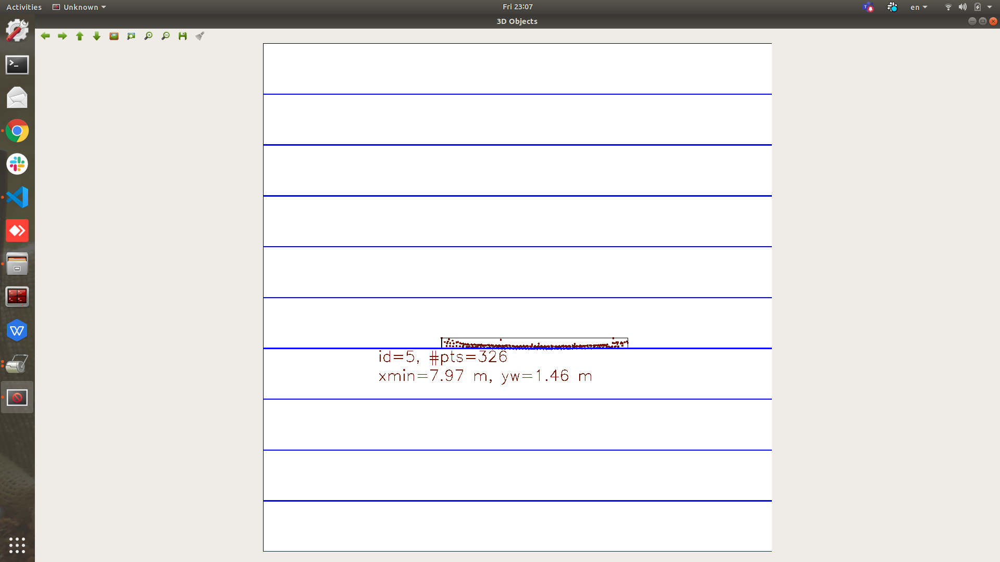
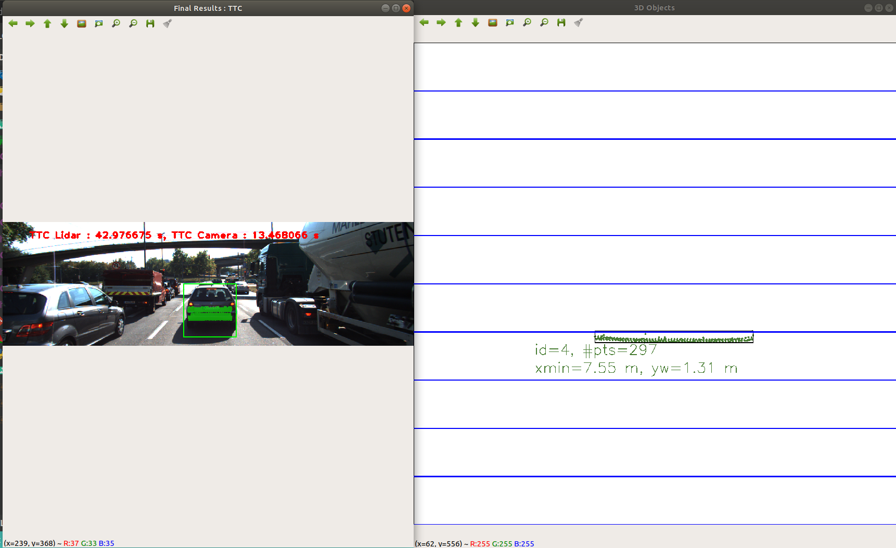

# Project report

## FP.1 : Match 3D Objects

In this task, please implement the method "matchBoundingBoxes", which takes as input both the previous and the current data frames and provides as output the ids of the matched regions of interest (i.e. the boxID property)“. Matches must be the ones with the highest number of keypoint correspondences.

=> In `matchBoundingBoxes()` function, used multimap data structure to create a matching list of previous and current bounding boxes. After that, for each of current boxes, we count the number of matches to each previous box and select the previous box with the largest number of keypoint matches.

## FP.2 : Compute Lidar-based TTC

In this part of the final project, your task is to compute the time-to-collision for all matched 3D objects based on Lidar measurements alone. Please take a look at the "Lesson 3: Engineering a Collision Detection System" of this course to revisit the theory behind TTC estimation. Also, please implement the estimation in a way that makes it robust against outliers which might be way too close and thus lead to faulty estimates of the TTC. Please return your TCC to the main function at the end of computeTTCLidar.

=> First, I estimate lane width (4.0) and select all x values of the lidar points on the same lane with vehicle. That will help eliminate outliers by y axis. Using k = 10 LiDAR points that are nearest from vehicle, I calculate mean X values of previous frame and current frame. After that, I use following equations to calculate the TTC:

```
double dT = 1.0 / frameRate; // 1 frame time
double dX = prevXMean - currXMean; // X displacement
double v = dX / dT; // 1 frame velocity
TTC = currXMean / v;
```

Mean calculation here is used as a statistically robust way to avoid severe estimation errors.

## FP.3 : Associate Keypoint Correspondences with Bounding Boxes

Before a TTC estimate can be computed in the next exercise, you need to find all keypoint matches that belong to each 3D object. You can do this by simply checking whether the corresponding keypoints are within the region of interest in the camera image. All matches which satisfy this condition should be added to a vector. The problem you will find is that there will be outliers among your matches. To eliminate those, I recommend that you compute a robust mean of all the euclidean distances between keypoint matches and then remove those that are too far away from the mean.

=> Function `clusterKptMatchesWithROI()` is implemented for this task. I calculate the mean distance for all matches and create kptMatches_roi as the list of all matches in current bounding box. After that, boundingBox.kptMatches is the filtered list of all matches in kptMatches_roi where the distance < 0.8 * distMean (mean distance) to eliminate outliers.

## FP.4 : Compute Camera-based TTC

Once keypoint matches have been added to the bounding boxes, the next step is to compute the TTC estimate. As with Lidar, we already looked into this in the second lesson of this course, so you please revisit the respective section and use the code sample there as a starting point for this task here. Once you have your estimate of the TTC, please return it to the main function at the end of computeTTCCamera.



=> I derived the equation to calculate camera-based TTC based on pin hole camera model in the above image. In the implementation, I calculate the change in the distance between each keypoint pair. After that, I use the median of distance ratio to calculate TTC based on above equations. 

## FP.5 : Performance Evaluation 1

This exercise is about conducting tests with the final project code, especially with regard to the Lidar part. Look for several examples where you have the impression that the Lidar-based TTC estimate is way off. Once you have found those, describe your observations and provide a sound argumentation why you think this happened.

=> The distances measured by the lidar are good. I also applied cropping and mean calculation to reduce the bad effect of outliers. Therefore, the distance between our vehicle and the forward car is calculated quite accurately. However, because the box displacement between 2 continuous frames is often small, the relative velocity estimation using that displacement is not very accurate. That's the reason why the TTC is very sensitive to noise and sometimes it is estimated inaccurately.





## FP.6 : Performance Evaluation 2

This last exercise is about running the different detector / descriptor combinations and looking at the differences in TTC estimation. Find out which methods perform best and also include several examples where camera-based TTC estimation is way off. As with Lidar, describe your observations again and also look into potential reasons. This is the last task in the final project.

**Mean Absolute Error Table - Generated by gen_report.py**

|Detector + Descriptor|0|1|2|3|4|5|6|7|8|9|10|11|12|13|14|15|16|17|18|Mean Error|
|---|---|---|---|---|---|---|---|---|---|---|---|---|---|---|---|---|---|---|---|---|
|SHITOMASI+BRISK| X |0.540658|2.26843|4.22618|2.32028|0.0347968|5.77721|22.2508|8.95346|0.723529|6.04457|1.91416|0.0712174|3.53174|1.29055|2.59627|1.19441|2.28695|1.61613|3.75785|
|**SHITOMASI+BRIEF**| X |1.73908|2.76776|7.90119|1.26232|1.60463|3.20485|1.99139|8.16421|1.02734|2.93526|1.17207|0.744356|3.17552|0.345801|4.86114|2.22225|0.407913|1.07595|**2.58906**|
|SHITOMASI+ORB| X |0.721687|3.0345|9.4251|1.08868|0.686537|5.02326|18.7183|7.06734|1.06276|3.2817|1.30774|0.402065|3.48165|0.31947|0.735634|47.5376|0.926317|1.73761|5.91988|
|SHITOMASI+FREAK| X |0.297991|0.136145|3.46479|1.62693|0.656182|6.00969|12.872|5.83686|1.5302|2.00424|0.867834|1.61156|3.50425|0.369614|7.47906|2.52423|0.730459|4.51762|3.11331|
|SHITOMASI+AKAZE| X |1.34115|1.36653|5.18291|2.1166|3.92988|4.13212|16.5908|5.00577|1.71263|2.35844|4.32388|0.584915|1.39726|2.81883|1.60252|1.2745|1.44574|0.636024|3.21225|
|SHITOMASI+SIFT| X |1.0193|0.785083|6.64106|0.465613|1.42891|4.96123|20.0266|7.73138|0.861888|2.12138|1.72659|0.556947|3.7974|0.0507515|2.41161|1.92111|1.38037|0.615927|3.25017|
|HARRIS+BRISK| X |0.239117|2.96042|4.69894|1.26232|13.7411| X |21.0885|9.32444|1.95518|1.87971|14.46|2.41051|159.793|1.10331|3.62522|4.16617|0.659533| X |15.2105|
|HARRIS+BRIEF| X |3.11758|4.19653|0.888103|0.276089|0.506772| X |20.1765|6.48872|0.529725|4.09662|1.71063|1.20713|2.13083|0.56063|5.08496|3.01184|2.3293|0.338921|3.33241|
|HARRIS+ORB| X |93.2962|545.299|28.7964|1.09139|17.8504|5.07086|21.4531|7.87365|0.943857|3.29979|2.93187|1.52067|50.4718|23.1243|3.48626| X |2.9873|2.17695|47.7455|
|HARRIS+FREAK| X |2.00947|13.9918|20.826|2.69405|1.62647|8.11603|20.4017|6.83096|0.614703|16.2067|1.78667|3.66784|2.32492|3.47638|4.60746|2.42831|0.753994|0.353994|6.26208|
|HARRIS+AKAZE| X |1.34115|1.36653|5.18291|2.1166|3.92988|4.13212|16.5908|5.00577|1.71263|2.35844|4.32388|0.584915|1.39726|2.81883|1.60252|1.2745|1.44574|0.636024|3.21225|
|HARRIS+SIFT| X |2.52483|0.129735|7.16767|1.05857|3.35055|7.52522|20.8666|7.20359|1.05729|2.31379|0.596625|2.36258|3.56393|1.0962|3.72805|2.11021|3.77937|3.63855|4.11519|
|FAST+BRISK| X |0.642061|1.1772|6.39656|0.373965|1.17761|5.35221|19.5059|8.01213|0.262632|4.06462|3.25045|2.3816|4.25432|1.40033|4.88515|4.46293|2.44318|2.57237|4.03418|
|FAST+BRIEF| X |5.39155|4.42332|5.66067|3.37824|0.312559|4.66138|22.6586|7.51384|0.0564643|2.92258|2.72912|0.251493|3.47948|1.11134|2.9737|1.82864|1.77937|1.03855|4.00949|
|FAST+ORB| X |2.7569|6.27994|5.38286|0.442115|16.4021| X |20.9833|7.70179|0.790187|3.12779|20.3964|64.4555|4.49637|1.03136|1.92204|4.80253|2.88257|2.0989|9.76192|
|FAST+FREAK| X |0.0786355|0.0331274|1.8772| X | X |4.2458|21.3715|7.05152|1.20954|1.67861|3.96524|2.93608|3.58639|2.51099|1.47918|3.2999|2.56082|2.12891|3.75084|
|FAST+AKAZE| X |1.34115|1.36653|5.18291|2.1166|3.92988|4.13212|16.5908|5.00577|1.71263|2.35844|4.32388|0.584915|1.39726|2.81883|1.60252|1.2745|1.44574|0.636024|3.21225|
|FAST+SIFT| X |2.03677|0.660803|5.43502|1.848|0.290657|4.64215|21.1044|7.36874|1.05193|1.32714|2.93187|1.31772|3.83754|0.478159|2.41193|3.06687|0.970548|2.09381|3.493|
|BRISK+BRISK| X |9.27749|11.0711|5.72655|0.950088|5.46383|8.36642|18.7446|4.55668|2.71016|1.09371|5.34064|0.865847|3.10023|4.41822|4.61817|3.09154|1.14697|1.68891|5.12395|
|BRISK+BRIEF| X |1.22072|1.67734|3.80846|2.77162|0.184797|7.36563|24.8641|0.255186|6.8399|4.3651|0.859733|2.62808|2.99324|0.0631959|1.58202|1.95072|0.877484|2.91457|3.73455|
|BRISK+ORB| X |21.5043|7.90189|4.17524|0.950088|3.77925|13.8353|13.5835|6.48095|2.21957|5.2779|1.92429|1.05607|2.49569|20.6522|3.76583|3.99848|0.0539014|8.18497|6.76886|
|BRISK+FREAK| X |4.2|5.40059|8.56842|5.32535|6.45452|5.89317|24.1876|4.21182|2.62582|1.09213|3.06076|1.3612|5.7386|0.89984|5.25098|2.05529|0.0951737|1.93944|4.90893|
|BRISK+AKAZE| X |1.34115|1.36653|5.18291|2.1166|3.92988|4.13212|16.5908|5.00577|1.71263|2.35844|4.32388|0.584915|1.39726|2.81883|1.60252|1.2745|1.44574|0.636024|3.21225|
|BRISK+SIFT| X |0.131505|6.99402|3.93825|3.528|17.1859|9.24908|17.903|2.69012|1.97785|2.92059|1.2748|0.633138|2.17738|0.405014|3.12853|4.15252|0.0449207|4.36878|4.59464|
|ORB+BRISK| X |3.49241|1.75194|54.4905| X | X | X |24.0434| X | X |3.62781|0.433863| X | X |2.45929| X |16.8282|10.3834| X |13.0568|
|ORB+BRIEF| X |4.34948|2.3618|0.66988|8.55181|0.612064| X |23.3175| X |177.195|4.55023|11.2465| X |13.4502|4.43138|5.7081|0.830681|0.596842|3.08183|17.3969|
|ORB+ORB| X |2.96823| X |6.54636| X |0.865878| X | X | X | X | X |3.17427| X |3.19084|17.6809|16.608|13.7857|15.4157|16.154|9.63899|
|ORB+FREAK| X |3.13846|26.9171|7.89119| X |6.18924| X | X | X |0.546207|5.91393|1.44092|2.84207|0.979198|1.70851| X |1.85705| X | X |5.40217|
|ORB+AKAZE| X |1.34115|1.36653|5.18291|2.1166|3.92988|4.13212|16.5908|5.00577|1.71263|2.35844|4.32388|0.584915|1.39726|2.81883|1.60252|1.2745|1.44574|0.636024|3.21225|
|ORB+SIFT| X |4.97319|0.625381|6.36806| X | X | X | X |9.27827| X |3.88453|2.02212| X |4.07968|2.26417|163.889|0.334184|11.5638|20.6071|19.1575|
|AKAZE+BRISK| X |0.725581|1.34008|5.22047|1.89038|0.740388|4.3515|17.2911|5.83625|0.448138|2.07456|3.03182|1.12653|0.560258|2.1951|2.62687|1.24877|1.87558|0.655375|2.95771|
|**AKAZE+BRIEF**| X |1.35944|0.101893|6.08444|1.73006|0.693786|4.25876|17.9653|5.2051|0.191262|3.32364|2.23034|0.234653|1.98906|0.415765|2.24235|1.18789|1.00343|1.05336|**2.84836**|
|AKAZE+ORB| X |3.24465|0.398156|6.05493|2.74757|0.44214|5.63507|16.5285|6.20239|1.04071|3.20034|3.62092|0.445698|5.14243|0.824296|18.0927|1.6781|2.20829|0.142646|4.31386|
|AKAZE+FREAK| X |1.60488|0.37184|4.28819|2.33714|1.87655|5.37314|15.0652|6.67965|0.935732|3.52711|2.67224|2.05508|0.808534|0.636561|0.577554|3.66673|1.26181|0.519318|3.01429|
|AKAZE+AKAZE| X |1.34115|1.36653|5.18291|2.1166|3.92988|4.13212|16.5908|5.00577|1.71263|2.35844|4.32388|0.584915|1.39726|2.81883|1.60252|1.2745|1.44574|0.636024|3.21225|
|AKAZE+SIFT| X |1.32057|1.33629|5.44194|1.98388|0.678364|6.37145|17.2087|5.54338|0.271787|3.5592|2.56848|0.0754724|1.92104|0.991467|1.75704|1.83376|0.651131|1.06608|3.03222|
|**SIFT+BRISK**| X |1.71636|0.688634|5.39736|3.49589|1.72576|2.85987|12.9826|0.746807|1.47881|3.8043|4.74801|0.364058|0.706815|2.22213|1.85756|0.483048|1.9039|0.348449|**2.64057**|
|SIFT+BRIEF| X |2.04791|0.724719|4.75265|6.89411|0.39678|4.43886|21.3063|4.68906|0.65019|5.81213|0.297617|0.0960099|0.207517|0.512117|0.367246|0.0872693|2.0928|2.60104|3.2208|
|SIFT+FREAK| X |2.5995|2.55904|3.69244|1.57948|1.11072|3.56631|19.0423|2.21348|1.13285|3.50652|3.08168|0.236594|0.749179|0.0131931|3.49035|0.679527|1.39712|3.21042|2.99226|
|SIFT+AKAZE| X |1.34115|1.36653|5.18291|2.1166|3.92988|4.13212|16.5908|5.00577|1.71263|2.35844|4.32388|0.584915|1.39726|2.81883|1.60252|1.2745|1.44574|0.636024|3.21225|
|SIFT+SIFT| X |3.4964|2.04108|5.64425|3.17651|0.844499|3.19101|19.5318|4.21631|0.833203|4.18537|1.01555|0.874159|1.02731|0.130439|1.97055|2.20223|1.84158|0.744972|3.16485|

**SIFT + ORB:** Out of memory error.

- Based on the results above, the following combinations provide the best mean absolute error: **SHITOMASI+BRIEF, AKAZE+BRIEF and SIFT+BRISK**.
- Some combinations take a lot of time to calculate features and matches (e.g. **HARRIS+ORB, **), so it's very challenging to apply them in real-time.
- Combinations based on ORB detector often fail to estimate TTC. That may be because it cannot detect enough keypoints.


- HARRIS+ORB provides not very accurate TTCs may be because it produces too many wrong keypoints and matching.


